````markdown
# 데이터 흐름도 [작업번호]

> 정책 SOT: <정책서 link>
> 도메인 SOT: <도메인 명세서 link>
> UI 흐름도: <UI 흐름도 link>
> 통신 명세서 서브페이지: <통신 명세서 link>
> 이전 버전: <referenceWork 작업번호 + Notion 링크 | 코드베이스 (<경로>) | —>

## 페르소나 인벤토리

| 페르소나 | 주요 시나리오 |
|---|---|
| ... | ... |

## 엔터티 책임 매트릭스

| 엔터티 | 상태 주체 | 비고 |
|---|---|---|
| ... | ... | ... |

## (optional) 상태 모델 동기화 메모

> 데이터 흐름도가 도메인 명세서 §3와 다른 추상화를 도입했다면 대응표로 명시. 동일하면 "동일" 한 줄.

| 데이터 흐름도 상태 | 도메인 §3 대응 |
|---|---|

## <페르소나> 섹션

(각 페르소나 반복)

### <페르소나> 시퀀스 다이어그램

```mermaid
sequenceDiagram
    actor X as <페르소나>
    participant FE as <페르소나> 클라이언트
    participant BE as 서버
    participant DB as DB

    rect rgb(50, 60, 80)
        Note over X,BE: <단계명>
        X->>FE: [<페르소나>:Action:N] ...
        FE->>BE: ...
        BE->>DB: ...
        BE-->>FE: [<페르소나>:Event:N] ...
    end
```



### <페르소나> 액션·채널 매트릭스

| ID | 단계명 | 채널 | 메서드/이벤트명 |
|---|---|---|---|
| <페르소나>:Action:1 | ... | Socket / API | <cmd 또는 endpoint> |
| <페르소나>:Event:1 | ... | Socket | <cmd> |

## 수정사항

회의 결과 기록.

## 변경 이력

(workType=update 또는 재publish 시 1행 이상. 이전 버전 없이 코드베이스 산출이면 첫 행 `최초 작성`. — state-schema §6)

| 일자 | 작업자 | 변경 요약 | 참고본 |
|---|---|---|---|
| YYYY-MM-DD | <작업자> | <이번 수정 요약 / 최초 작성> | <referenceWork 작업번호 / 코드베이스: <경로> / —> |
````
