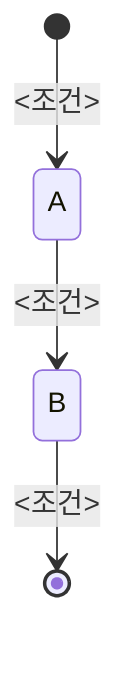

# 도메인 명세서 [작업번호]

> 정책 SOT: <정책서 Notion link>
> 용어 / 파라미터 / 페르소나 / 정책 카탈로그 / 예외·롤백은 정책서 직접 참조.
> 본 문서는 엔지니어링 elaborate 영역 (엔터티 · 페르소나별 시나리오 · 상태 머신 · 결정 필요 항목)만 다룬다.
> 이전 버전: <referenceWork 작업번호 + Notion 링크 | 코드베이스 (<경로>) | —>

## 1. 엔터티

### <엔터티명>

| 필드 | 설명 |
|---|---|
| ... | ... |

(각 엔터티 반복. 유비쿼터스 언어로 도메인 의미 속성만 — `id`·외래키 등 DB 식별자는 데이터 흐름도에서 확정.)

## 2. 페르소나별 시나리오

도메인에 등장하는 페르소나와 각 페르소나가 트리거하거나 관여하는 주요 시나리오. 어휘는 §3 전이 규칙 `페르소나` 열과 일치한다.

| 페르소나 | 주요 시나리오 |
|---|---|
| ... | ... |

## 3. 도메인 상태 머신

### 3.1 <엔터티명> 상태

**전이 규칙**

| From → To | 조건 | 페르소나 |
|---|---|---|
| ... | ... | ... |

**불변식**

- ...

(상태 머신이 필요한 엔터티마다 반복. 상태 없는 엔터티는 §3에 등장하지 않음.)

## 4. 결정 필요 항목 (write-policy-feedback / 정책서 후속)

- ...

(없으면 "현재 없음")

## 변경 이력

(workType=update 또는 재publish 시 1행 이상. 이전 버전 없이 코드베이스 산출이면 첫 행 `최초 작성`. — state-schema §6)

| 일자 | 작업자 | 변경 요약 | 참고본 |
|---|---|---|---|
| YYYY-MM-DD | <작업자> | <이번 수정 요약 / 최초 작성> | <referenceWork 작업번호 / 코드베이스: <경로> / —> |
